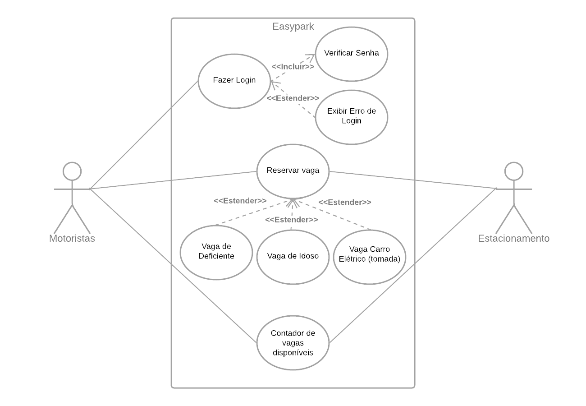

# Especificações do Projeto

A definição exata do problema e os pontos mais relevantes a serem tratados neste projeto foi consolidada com a participação dos usuários em um trabalho de imersão feita pelos membros da equipe a partir da observação dos usuários em seu local natural e por meio de entrevistas. Os detalhes levantados nesse processo foram consolidados na forma de personas e histórias de usuários. 

## Personas

|Ana Clara Pereira||
|---|---| 
|Idade: 35 anos|Ocupação: Gestora de Recursos Humanos|
|Tipo de Veículo: Utilitário 100% elétrico||
|Motivações: | <ul><li>Limitação de locais para recarregar o carro.</li><li> Não ficar sem bateria para chegar em casa</li></ul>|
|Hobbies:|<ul><li>Praticar artes marciais</li><li>Dançar Forró</li></ul>|

|Augusto Silva||
|---|---| 
|Idade: 42 anos|Ocupação: Vendedor de Maquinário Industrial|
|Tipo de Veículo: Carro SW||
|Motivações: | <ul><li>Visitar clientes constantemente.</li><li> Saber de antemão onde tem estacionamentos próximos dos clientes</li><li>Reservar vagas para não atrasar nos seus encontros</li></ul>|
|Hobbies:|<ul><li>Viajar</li><li>Pescar</li></ul>|

|Carlos Alves||
|---|---| 
|Idade: 29 anos|Ocupação: Scrum Master|
|Tipo de Veículo: Scooter||
|Motivações: | <ul><li>Gosta da segurança e praticidade de um estacionamento privativo.</li><li> Economizar na mensalidade/anuidade ao pagar o estacionamento.</li><li>Estacionar em locais em que haja convênio com a empresa em que trabalha</li></ul>|
|Hobbies:|<ul><li>Jogar videogames</li><li>Praticar musculação</li></ul>|

|Diego Costa||
|---|---| 
|Idade: 45 anos|Ocupação: Empresário|
|Tipo de Veículo: Picape 4x4||
|Motivações: | <ul><li>Reservar vagas próximas à escola do filho.</li><li> Não ter que esperar em fila-dupla.</li></ul>|
|Hobbies:|<ul><li>Jogar futebol</li><li>Tocar violão</li></ul>|

|Luisa Ruiz||
|---|---| 
|Idade: 21 anos|Ocupação: Estudante Universitária|
|Tipo de Veículo: Hatchback||
|Motivações: | <ul><li> Buscar seu tio que fez uma operação na perna.</li><li> Estacionar próximo o hospital para facilitar para seu passageiro com locomoção deteriorada.</li></ul>|
|Hobbies:|<ul><li>Trabalho voluntário</li><li>Jardinagem</li></ul>|

|Pedro Pascoal||
|---|---| 
|Idade: 34 anos|Ocupação: Arquiteto|
|Tipo de Veículo: SUV adaptada||
|Motivações: | <ul><li> Frequentar estabelecimentos com acesso adaptado à cadeirantes.</li><li> Estacionar em locais com vagas preferênciais.</li></ul>|
|Hobbies:|<ul><li>Frequentar shows de comédia</li><li>Viajar</li></ul>|

|Rita Luz||
|---|---| 
|Idade: 61 anos|Ocupação: Professora Aposentada|
|Tipo de Veículo: Sedan||
|Motivações: | <ul><li> Frequentar estabelecimentos com poucas escadas ou rampas.</li><li> Estacionar em locais com vagas preferênciais.</li></ul>|
|Hobbies:|<ul><li>Fotografia</li><li>Leitura</li></ul>|

|Michael Oliveira||
|---|---| 
|Idade: 31 anos|Ocupação: Engenheiro Civil|
|Tipo de Veículo: Sedan||
|Motivações: | <ul><li> Proteger o carrro do sol e outros elementos.</li><li> Estacionar em local com segurança robusta.</li></ul>|
|Hobbies:|<ul><li>Participar de exposições de carros</li><li>Assistir à corridas profissionais</li></ul>|

## Histórias de Usuários

Com base na análise das personas forma identificadas as seguintes histórias de usuários:

|EU COMO... `PERSONA`| QUERO/PRECISO ... `FUNCIONALIDADE` |PARA ... `MOTIVO/VALOR`                 |
|--------------------|------------------------------------|----------------------------------------|
| Ana Clara Pereira  |	Estacionamento com recarga para carro eletrico |	Para que ela não fique sem bateria para continuar o seu afazeres diários |
| Augusto Silva | Estacionamento próximo a seus clientes | Para não perder tempo procurando vaga |
| Carlos Alves  | Estacionamento conveniada com sua empresa | Para economizar na hora de estacionar o carro nas visitas |
| Diego Costa   | Estacionar o carro próximo a escola | Aguardar o fim do período da aula do filho para busca-lo estando próximo da escola |
| Luiza Ruiz    | Estacionar o carro próximo ao hospital| Buscar um familiar no hospital tendo o maior conforto possível numa vaga mais próxima ao hospital |
| Pedro Pascoal | Classificação de vagas para deficiente físico | Possui deficiência física, assim busca vagas preferencias para melhor se locomover |
| Rita Luz | Classificação de vagas para idosos | Deseja usufruir seu direito como idosoa para usar vaga preferencial |
| Michael Oliveira | Classificação de vagas cobertas | Fanático pelo bem estar físico do seu carro e deseja uma vaga coberta |

## Requisitos

O escopo funcional do projeto é definido por meio dos requisitos funcionais que descrevem as possibilidades interação dos usuários, bem como os requisitos não funcionais que descrevem os aspectos que o sistema deverá apresentar de maneira geral. Estes requisitos são apresentados a seguir.

### Requisitos Funcionais

A tabela a seguir apresenta os requisitos do projeto, identificando a prioridade em que os mesmos devem ser entregues.

|ID    | Descrição do Requisito  | Prioridade |
|------|-----------------------------------------|----|
| RF-001 | O site deve apresentar a funcionalidade de buscador (search) | ALTA | 
| RF-002 | O site deve apresentar categorias de vagas para facilitar a busca dos usuários | ALTA |
| RF-003 | O site deve apresentar as informações do estabelecimento e serviços extras oferecidos |ALTA |
| RF-004 | O site deve apresentar mecanismos para avaliação dos estabelecimentos através de comentário e notas | MÉDIA |
| RF-005 | O site deve recomendar estabelecimentos de acordo com o perfil de cada usuário | BAIXO |
| RF-006 | O site deve possuir um filtro para refinar a busca do usuário | ALTA |
| RF-007 | O site deve possuir uma área de login para que o usuário possa fazer efetuar reservas | ALTA |
| RF-008 | O site deve possuir uma área de login para as empresas fazer a gestão de suas reservas | ALTA |
| RF-009 | O site deve possuir uma área para cadastrar novos usuários e empresas | ALTA |
| RF-010 | O site deve possuir uma área para cadastrar novos prestadores de serviços | BAIXA |
| RF-011 | O site deve possuir dentro da área de login da empresa um resumo de feedback dos usuários | BAIXA |
| RF-012 | O site deve possuir um canal de comunicação direto com os administradores dentro da área de login de usuários e empresas | BAIXA | 
| RF-013 | O site deve ter dentro da área de login de usuários uma sessão de locais favoritados | MÉDIA |
| RF-014 | O site deve apresentar em sua home apenas os estabelecimentos mais bem avaliados | BAIXA |
| RF-015 | O site deve possuir uma categoria “Sobre Nós” | BAIXA | 
| RF-016 | O site deve possuir uma categoria “Fale Conosco” | BAIXA |
| RF-017 | O site deve possuir um contador de quantidades de vagas disponíveis e totais dos estabelecimentos | BAIXO |

### Requisitos não Funcionais

A tabela a seguir apresenta os requisitos não funcionais que o projeto deverá atender.

|ID     | Descrição do Requisito  |Prioridade |
|-------|-------------------------|----|
|RNF-001| O site deve ser responsivo | ALTA | 
|RNF-002| O site deve ser compatível com os principais navegadores | ALTA | 
|RNF-003| O site deve ter acessibilidade digital, seguindo as regras da WCAG 2.1 conforme normas da W3C | MÉDIA |

## Restrições

As questões que limitam a execução desse projeto e que se configuram como obrigações claras para o desenvolvimento do projeto em questão são apresentadas na tabela a seguir. 

|ID   | Restrição                                             |
|-----|-------------------------------------------------------|
|RE-01| O projeto deverá ser entregue no final do semestre, não podendo extrapolar a data de 31/11/2022 |
|RE-02| O site deve se restringir às tecnologias básicas da Web no Frontend e backend |
|RE-03| A equipe não pode subcontratar uma empresa para ajudar a desenvolver o design do site |
|RE-04| A equipe não pode subcontratar uma empresa para a criação do conteúdo do site |
|RE-05| O site só poderá ser lançado se os requisitos de funcionalidade e acessibilidade quando forem atendidas |

## Diagrama de Casos de Uso

O diagrama de casos de uso é o próximo passo após a elicitação de requisitos, que utiliza um modelo gráfico e uma tabela com as descrições sucintas dos casos de uso e dos atores. Ele contempla a fronteira do sistema e o detalhamento dos requisitos funcionais com a indicação dos atores, casos de uso e seus relacionamentos. 

As referências abaixo irão auxiliá-lo na geração do artefato “Diagrama de Casos de Uso”.

> **Links Úteis**:
> - [Criando Casos de Uso](https://www.ibm.com/docs/pt-br/elm/6.0?topic=requirements-creating-use-cases)
> - [Como Criar Diagrama de Caso de Uso: Tutorial Passo a Passo](https://gitmind.com/pt/fazer-diagrama-de-caso-uso.html/)
> - [Lucidchart](https://www.lucidchart.com/)
> - [Astah](https://astah.net/)
> - [Diagrams](https://app.diagrams.net/)
