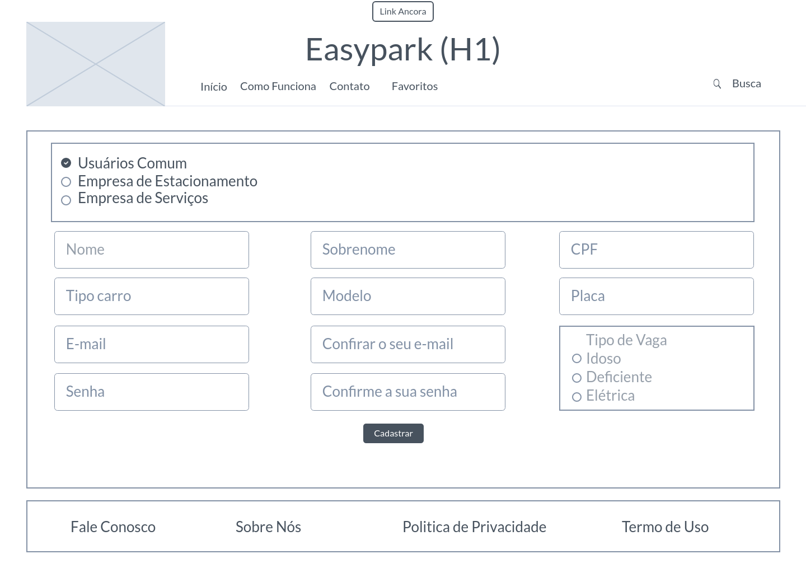

# Projeto de Interface

Dentre as preocupações para a montagem da interface do sistema, estamos estabelecendo foco em questões como agilidade, acessibilidade e usabilidade. Desta forma, o projeto tem uma identidade visual padronizada em todas as telas que são projetadas para funcionamento em desktops e dispositivos móveis.

## Diagrama de Fluxo

## Wireframes

Conforme fluxo de telas do projeto, apresentado no item anterior, as telas do sistema são apresentadas em detalhes nos itens que se seguem. As telas do sistema apresentam uma estrutura comum que é apresentada na figura a seguir. Nesta estrutura, existem 3 grandes blocos, descritos a seguir. São eles:

Header - local onde são dispostos elementos fixos de identidade (logo e nome do site), navegação principal do site (menu da aplicação) e Link Ancora (melhor acessibilidade para o site)
Conteúdo - apresenta o conteúdo da tela em questão;
Footnote - apresenta os elementos informativos sobre o site e politica de privacidade e comunicativos com os operadores do site.

## Tela - Home-Page

A tela de home-page mostra os estabelecimentos em destaque da semana a partir da API utilizada pelo sistema. 
Com base na estrutura padrão, o Bloco Header traz a logo e o nome do site, os botões links âncora, log in, cadastrar e a barra de pesquisa, além de botões de navegação. O Bloco Conteúdo traz os estabelecimentos em destaque da semana (nome do estabelecimento, quantidade de vagas disponíveis, nota do local, endereço e valor da hora). O Bloco Footnote traz os links para contado com os organizadores do site (Fale Conosco) e mais informações sobre o site (Sobre Nós, Política de Privacidade e Termos de Uso).

## Tela – Estacionamento

A tela do estacionamento apresenta, no Bloco Conteúdo, as informações do estacionamento, como endereço, valores serviços e facilidades que o local possui. O Bloco Header e Footnote apresenta os mesmos elementos da Home-Page.

## Tela - Reservar vaga

A tela de reservar vaga mostra os dados necessários para que seja feito a reserva de uma vaga no estacionamento, como hora de chegada e saida, tipo de vaga e data. O Bloco Header e Footnote apresenta os mesmos elementos da Home-Page.

## Tela – Serviços de Terceiros

A tela de serviços de terceiros apresenta, no Bloco Conteúdo, as informações do serviço selecionado, como nome e endereço. O Bloco Header e Footnote apresenta os mesmos elementos da Home-Page.

## Tela – Serviço de Terceiro Estabelecimento

A tela do serviço de terceiro selecionado apresenta, no Bloco Conteúdo, as informações do estabelecimento, como endereço, telefones e links para sites externos. O Bloco Header e Footnote apresenta os mesmos elementos da Home-Page.

## Tela – Log In

A tela de log in é uma janela modal (surge sobre outras janelas) quando o usuário pressiona o botão log in do header. Nela o usuário vai colocar seu e-mail e senha para logar. 

## Tela – Cadastro de Usuário Comum

A tela de cadastro de usuário comum apresenta, no Bloco Conteúdo, os input fields que o usuário precisa preencher para que o mesmo se cadastre no site, como o nome, e-mail, dados do carro, entre outras informações para que o usuário consiga cadastrar no site. O Bloco Header apresenta o logo e o nome do site e o botão de link ancora e o Bloco Footnote apresenta os mesmos elementos da Home-Page.

## Tela – Cadastro da Empresa de Estacionamento

A tela de cadastro da empresa de estacionamento presenta, no Bloco Conteúdo, os input field que o prestador de serviço precisa preencher para que as suas vagas sejam mostrados no site, como o nome da empresa, CNPJ, e-mail, cidade, quantidade de cada tipo de vagas entre outras informações. O Bloco Header apresenta o logo e o nome do site e o botão de link ancora e o Bloco Footnote apresenta os mesmos elementos da Home-Page.

## Tela – Cadastro de Prestador de Serviço

A tela de cadastro de prestador de serviço apresenta, no Bloco Conteúdo, os input field que o prestador de serviço precisa preencher para que o seu serviço seja mostrado no site, como o nome da empresa, CNPJ, e-mail, cidade, telefone entre outras informações. O Bloco Header apresenta o logo e o nome do site, o slogan e o botão de link ancora e o Bloco Footnote apresenta os mesmos elementos da Home-Page.

